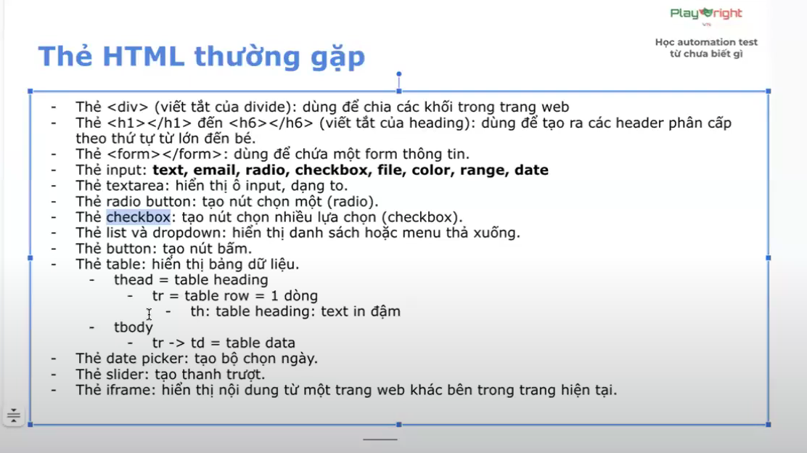

# DOM 
## DOM = Document Object Model 
## Các loại thẻ

1. Thẻ mở 
    ```javascript
     <option value = "usa">United State </option>
    ```
 
2. Thẻ tự đóng 
    ```javascript
     <image src="image.jpg" alt = Image description:/>
    ```

3. Các loại thẻ thường gặp 



4. Vẽ cây DOM 
tool: MindMup2.0 
# Selector
## Selector: là cách chon phần tử trên trang 
## Các kiểu Selector 
### XPath Selector
#### XPATH = XML PATH 
#### Có 2 loại: 
1. Tuyệt đối: Đi dọc theo cây DOM, bắt đầu bởi 1 /
2. Tương đối: tìm dựa vào đặc tính 
    - Bắt đầu bằng 2 // 
    ```javascript
     format:
     //tenthe[@thuoctinh="giatri"]
     vi dụ: 
     //div[@class='form-group']
     //div[@class='form-group' and @id='parent']

    ```
3.  Nên dùng XPath tương đối
4. Nên tìm theo thuộc tính "id"

### CSS Selector: TBD
### Playwright Selector: TBD


# Playwright syntax
## test 
test la mot don vi co ban khai bao test case 
#### Cau truc
```javascript
     import {test} from '@playwright/test';

     test ('ten test', async ({page}) => {
        code
     });
   ```
#### File thu thi test co duoi la a.spec.ts
vi du: play-syntax.spec.ts

## step
1. la don vi cua test, la buoc thuc thi cua test case.
2. Nên được map 1:1 với test cases
```javascript
    import { test } from '@playwright/test';

    test('test case name', async ({page}) => {
        await test.step('Navigate to material Playwright', async()=> {
            await page.goto('https://material.playwrightvn.com');

        })

        await test.step('Click vao bai 1', async() => {
                await page.locator(`//a[@href='01-xpath-register-page.html']`).click();

        })
    })
   ```

## Basic action 
#### Navigate
#### Click 
1. Single click 

   await page.locator("//button").click();
2. Double click 
```javascript
        await page.locator("//button").dblclick();

        test('Xu ly mouse', async ({page}) => {
        await test.step('Navigate to material Playwright', async()=> {
            await page.goto('https://material.playwrightvn.com');

        })

        await test.step('Click vao bai 5 - mouse event', async() => {
                await page.locator(`//a[@href='018-mouse.html']`).click();

        })

        await test.step('Click vao vung checkt', async() => {
            await page.locator(`//div[@id='clickArea']`).dblclick();

    })
    })
```

3. Click chuot phai 

    page.locator("//button").click({
        button: 'right'
    })
```javascript 
        test('Right click', async ({page}) => {
            await test.step('Navigate to material Playwright', async()=> {
                await page.goto('https://material.playwrightvn.com');

            })

            await test.step('Click vao bai 5 - mouse event', async() => {
                    await page.locator(`//a[@href='018-mouse.html']`).click();

            })

            await test.step('Click vao vung checkt', async() => {
                await page.locator(`//div[@id='clickArea']`).click({button: 'right'});

            })
        }) 
```
4. Click chuot phai kem bam phim khac 
```javascript
            page.locator("//button").click({
                modifiers: ['Shift']
            })

            test('event', async ({page}) => {
            await test.step('Navigate to material Playwright', async()=> {
                await page.goto('https://material.playwrightvn.com');

            })

            await test.step('Click vao bai 5 - mouse event', async() => {
                    await page.locator(`//a[@href='018-mouse.html']`).click();

            })

            await test.step('Click vao vung check', async() => {
                await page.locator(`//div[@id='clickArea']`).click({modifiers: ['Shift']});

            })
        }) 
```

4. Click nhieu lan 
```javascript 
test('click multiple times', async ({page}) => {
    await test.step('Navigate to material Playwright', async()=> {
        await page.goto('https://material.playwrightvn.com');

    })

    await test.step('Click vao bai 5 - mouse event', async() => {
            await page.locator(`//a[@href='018-mouse.html']`).click();

    })

    await test.step('Click vao vung check', async() => {
        await page.locator(`//div[@id='clickArea']`).click({clickCount:10});

    })
}) 
```
#### Input
1. Fill 

Giông với việc copy paste vào 1 ổ input 
```javascript 
        await test.step('Fill information', async() => {
            await page.locator(`//input[@id='username']`).fill('Huong');

        })
```
2. pressSequentially

Giống với việc gõ từng kí tự vào ô input
```javascript 
    await test.step('Fill information', async() => {
        await page.locator(`//input[@id='email']`).pressSequentially('huong@gmail.com',{delay: 1000});

    })
```

3. Thông thường dùng Fill nhiều hơn.

#### Checkbox and Radiobox
```javascript 
        let isChecked = await page.locator(`//input[@id='male']`).isChecked(); 
        if (isChecked == false){
            await page.locator(`//input[@id='male']`).check();
        } 

        await page.locator(`//input[@id='reading']`).check();
```

#### Select option
```javascript 
    await page.locator(`//select[@id='country']`).selectOption({value: 'uk'})

```

#### Upload file 
```javascript 
  await page.locator(`//select[@id='profile']`).setInputFiles('/data-test/image.png');
```